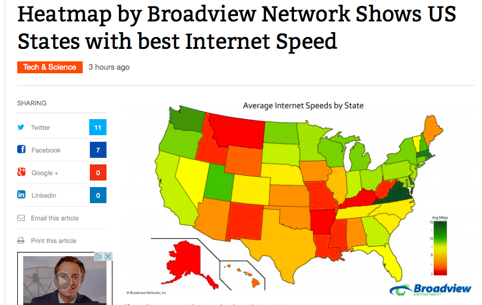

Title: Heat Map Gone Wild
Date: 2014-08-10
Tags: visualization

I stumbled on this rather striking example of cartography gone wild:

---

(Source: [Wall Street OTC])

---

So many things a cartographer could say about this. For starters, heat maps are typically used with raster data and
the state map depicted here uses a vector representation. Beyond that, the
color scheme induces a good bout of cognitive dissonance in the reader. A
*heat* map implies that hotter colors are associated with higher attribute
values (see an example [here]). But think of the viewer, what color would
be interpreted as hotter, red or green? Yeah, the red states of course. Actually, 
no, the green states (green as in go fast, I guess?) have higher broadband
speeds.

Ouch.

[Wall Street OTC]: http://www.wallstreetotc.com/heatmap-broadview-network-shows-us-states-best-internet-speed/26807/
[here]: http://en.wikipedia.org/wiki/Heat_map#mediaviewer/File:WOA09_sea-surf_SAL_AYool.png
