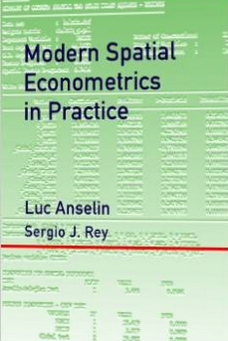

Title: Spatial Econometrics Documentation for PySAL
Date: 2014-12-31
Tags: pysal

Just in time for the New Year:

---

---

Available from [Amazon]:

> This book is the definitive user’s guide to the spatial regression
> functionality in the software packages GeoDa and GeoDaSpace, as well as the
> spreg module in the PySAL library –-all developed at the GeoDa Center for
> Geospatial Analysis and Computation. The book provides the techniques to test
> for and estimate spatial effects in linear regression models, addressing both
> spatial dependence (spatial autoregressive models) as well as spatial
> heterogeneity (spatial regimes models). The book also serves as an
> introduction and a practical guide to spatial econometrics in that it covers
> the methodological principles and formal results that underlie the various
> estimation methods, test procedures and model characteristics computed by the
> software. While the classical maximum likelihood estimation is included, the
> book’s coverage emphasizes modern techniques based on the principle of
> generalized method of moments (GMM).  

[Amazon]: http://www.amazon.com/gp/product/0986342106/sr=8-1/qid=1420070700/ref=olp_product_details?ie=UTF8&me=&qid=1420070700&sr=8-1
